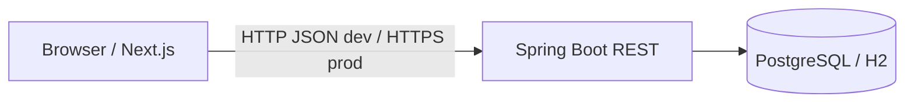

# Architecture

## Repository layout (monorepo)

```
TIcket System/
├── backend/          # Spring Boot API (Phase 2+)
├── frontend/         # Next.js UI (Phase 5+)
├── spec/             # Normative specifications (incl. development-workflow.md)
├── rules/            # AI / team coding guidelines
├── commands/         # Reusable review & test prompts
├── skills/           # Cursor skills
└── docs/             # Prompt history, AI review log
```

## Runtime diagram



## Backend (planned)

- **Java 21**, Spring Boot 3.x
- Layers: `web` → `service` → `repository` → JPA entities
- **State machine** in service layer only
- Profiles:
  - `dev` — H2 file or in-memory (configurable)
  - `test` — H2 for tests
  - `postgres` — PostgreSQL via env (`DB_URL`, `DB_USER`, `DB_PASSWORD`)

Default ports: API `8080`, frontend `3000`.

## Frontend (planned)

- **Next.js** (App Router), TypeScript
- `lib/api.ts` — fetch wrapper, maps API errors to UI messages
- Pages: ticket list (search + status filter), create ticket, ticket detail (edit fields, comments, status actions)

## Cross-cutting

- CORS: API allows frontend origin from environment
- Error handling: single error DTO shape (see `rules/api-standards.md`)
- No auth in MVP: comment `author` is sent in the request body (`spec/api-contract.md`)

## Development workflow

1. Update spec slice → `commands/review-spec.md`
2. Implement backend or frontend phase
3. Test per `test-strategy.md`
4. `commands/review-code.md` → log issues in `docs/ai-review-log.md`
5. Commit per phase

## Phase roadmap

| Phase | Deliverable | Status |
|-------|-------------|--------|
| 1 | Hygiene + spec (this document set) | Complete |
| 2 | Backend: ticket CRUD + validation + H2 | Complete |
| 3 | State machine + integration tests | Complete |
| 4 | Comments, search, filter APIs | Complete |
| 5 | Frontend list + create | Complete |
| 6 | Frontend detail, comments, search, filter | Complete |
| 7 | Status UI + error polish | Complete |
| 8 | PostgreSQL profile + persistence verification | Complete |

Detailed FR/API mapping: `spec/implementation-status.md`.
