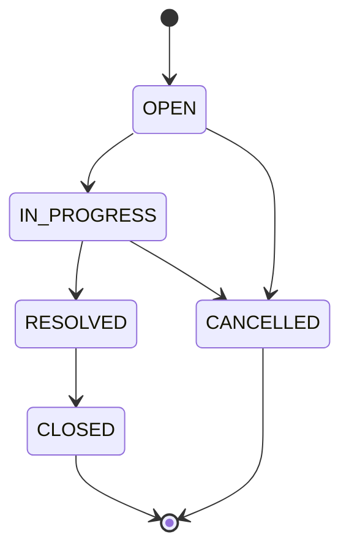

# Ticket Status State Machine

## States

- `OPEN`
- `IN_PROGRESS`
- `RESOLVED`
- `CLOSED` (terminal)
- `CANCELLED` (terminal)

## Allowed transitions

| From | To |
|------|-----|
| OPEN | IN_PROGRESS |
| OPEN | CANCELLED |
| IN_PROGRESS | RESOLVED |
| IN_PROGRESS | CANCELLED |
| RESOLVED | CLOSED |

## Diagram

## Forbidden examples (must return 409)

| From | To | Result |
|------|-----|--------|
| CLOSED | OPEN | Reject |
| RESOLVED | OPEN | Reject |
| CANCELLED | OPEN | Reject |
| CLOSED | IN_PROGRESS | Reject |
| RESOLVED | IN_PROGRESS | Reject |
| OPEN | CLOSED | Reject (must go via IN_PROGRESS → RESOLVED) |
| OPEN | RESOLVED | Reject |
| RESOLVED | CANCELLED | Reject |

## Rules

1. Backend MUST reject any transition not listed in **Allowed transitions**.
2. Same-state transition (e.g. OPEN → OPEN) SHOULD be rejected with `409` or treated as no-op — **MVP: reject with 409** for clarity in tests.
3. Terminal states: `CLOSED`, `CANCELLED` — no outgoing transitions.
4. Creation always sets `OPEN`; no other initial state.

## Test matrix (for Phase 3)

Generate tests for:

- Each allowed transition (happy path)
- Each forbidden example above
- Additional random invalid pairs (e.g. `CANCELLED` → `CLOSED`)
